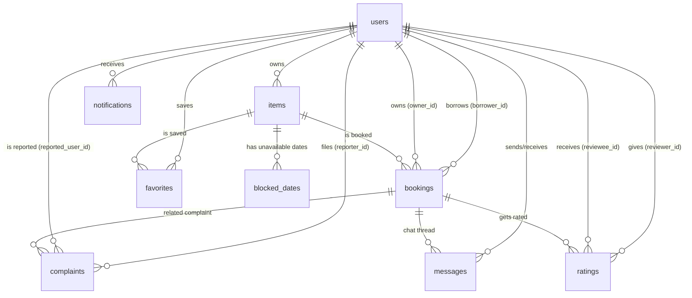

# CS Dept Resource Sharing — Database Schema Documentation

**Database:** PostgreSQL (`resource_sharing_db`)
**Total Tables:** 10
**Source:** Exact types niche `information_schema.columns` query se liye gaye hain (verified against the live database)

---

## ⚠️ Action Needed — Missing Column

Live database check karne par pata chala ki `users` table me **`block_source` column maujood nahi hai**, jabki code (`db.js` ke `setBlocked`, `checkAndApplyAutoBlock`) ise use karta hai. Jab tak ye column nahi banta, **koi bhi block/unblock action (manual ya auto) crash karega** (`column "block_source" does not exist`).

Database me ye SQL chala do:
```sql
ALTER TABLE users ADD COLUMN IF NOT EXISTS block_source VARCHAR(10);
UPDATE users SET block_source = 'manual' WHERE is_blocked = true AND block_source IS NULL;
```

---

## Kaise padhein ye document

Postgres me columns `snake_case` (jaise `owner_id`) me hain, lekin backend se frontend jaate waqt automatically `camelCase` (jaise `ownerId`) ban jate hain — `db.js` ka `rowToCamel()` function ye karta hai. Har row ka Postgres `id` column frontend me `_id` ban jata hai (purani MongoDB-style codebase ki aadat).

---

## 1. `users` — Student & Admin Accounts

| Column | Type | Nullable | Default | Matlab |
|---|---|---|---|---|
| `id` | varchar | NO | — | `usr_std_...` / `usr_admin_...` prefix wali unique ID |
| `name` | varchar | NO | — | Poora naam |
| `email` | varchar | NO | — | College email (unique) |
| `password_hash` | varchar | NO | — | bcrypt hashed password |
| `enrollment_number` | varchar | NO | — | Unique enrollment number |
| `mobile_number` | varchar | YES | — | Contact number |
| `department` | varchar | YES | — | Default app-side: "Computer Science & Engineering" |
| `semester` | varchar | YES | — | — |
| `role` | varchar | NO | `'student'` | `'student'` ya `'admin'` |
| `verified` | boolean | YES | `true` | ⚠️ **Legacy/unused** — current code (`db.js`) kahin iska reference nahi karta. Shayad purani email-verification ki koshish ka leftover hai (ab OTP flow `email_otps` table use karta hai). Kisi ko iska use pata ho to batana, warna ignore kar sakte ho |
| `is_blocked` | boolean | YES | `false` | True hone par login block |
| `block_source` | varchar | — | — | ⚠️ **DB me abhi exist nahi karta** — upar wali SQL chalao |
| `avatar` | text | YES | — | Profile photo URL |
| `complaint_count` | integer | YES | `0` | Non-rejected complaints ka cached count |
| `average_rating` | numeric | YES | `5.0` | Peer review average |
| `total_ratings` | integer | YES | `0` | Kitne reviews mile |
| `created_at` | timestamptz | YES | `now()` | — |
| `updated_at` | timestamptz | YES | `now()` | — |

**Jude hue tables:** `items`, `bookings` (borrower + owner), `complaints` (reporter + reported), `ratings` (reviewer + reviewee), `messages`, `notifications`, `favorites`

---

## 2. `items` — Listed Resources

| Column | Type | Nullable | Default | Matlab |
|---|---|---|---|---|
| `id` | varchar | NO | — | `itm_...` |
| `owner_id` | varchar (FK → users.id) | YES | — | Kisne list kiya |
| `title` | varchar | NO | — | Item ka naam |
| `category` | varchar | YES | — | Jaise "Calculators" |
| `description` | text | YES | — | — |
| `images` | array (text[]) | YES | — | Image URLs ki list |
| `rent_price_per_day` | numeric | NO | — | ₹/day |
| `security_deposit` | numeric | YES | `0` | Refundable deposit |
| `availability` | boolean | YES | `true` | Owner ne on/off kiya |
| `condition` | varchar | YES | — | "Good", "Like New" etc. |
| `pickup_location` | varchar | YES | — | — |
| `created_at` | timestamptz | YES | `now()` | — |
| `updated_at` | timestamptz | YES | `now()` | — |

**Note:** Owner ka naam/email/photo yahan store nahi — har query `users` se live JOIN karti hai (`ITEM_SELECT`), taaki profile update hone par stale na rahe.

**Jude hue tables:** `users` (owner), `bookings`, `blocked_dates`, `favorites`

---

## 3. `blocked_dates` — Owner-Managed Unavailability

| Column | Type | Nullable | Default | Matlab |
|---|---|---|---|---|
| `id` | varchar | NO | — | `blk_...` |
| `item_id` | varchar (FK → items.id) | YES | — | — |
| `start_date` | date | NO | — | — |
| `end_date` | date | NO | — | — |
| `reason` | text | YES | — | Default app-side: "Owner unavailable" |
| `created_at` | timestamptz | YES | `now()` | — |

**Jude hue tables:** `items`

---

## 4. `favorites` — Wishlist (Join Table)

| Column | Type | Nullable | Default | Matlab |
|---|---|---|---|---|
| `user_id` | varchar (FK → users.id) | NO | — | — |
| `item_id` | varchar (FK → items.id) | NO | — | — |
| `created_at` | timestamptz | YES | `now()` | — |

Proper many-to-many join table hai, user object ke andar array nahi.

---

## 5. `bookings` — Rental Requests

| Column | Type | Nullable | Default | Matlab |
|---|---|---|---|---|
| `id` | varchar | NO | — | `bkg_...` |
| `item_id` | varchar (FK → items.id) | YES | — | — |
| `borrower_id` | varchar (FK → users.id) | YES | — | — |
| `owner_id` | varchar (FK → users.id) | YES | — | — |
| `start_date` | date | NO | — | — |
| `end_date` | date | NO | — | — |
| `total_days` | integer | YES | — | — |
| `total_cost` | numeric | YES | — | Rent + deposit + (agar Fast Delivery) surcharge |
| `status` | varchar | YES | `'Pending'` | `Pending` → `Accepted`/`Rejected`/`Expired` → `Completed` |
| `is_fast_delivery` | boolean | NO | `false` | True = "30 min me accept karo" wali booking |
| `fast_delivery_fee` | numeric | NO | `0` | Rental fee ka 25% (sirf fast delivery) |
| `expires_at` | timestamp *(no tz)* | YES | — | Fast delivery deadline (`created_at + 30 min`), sirf backend set karta hai |
| `accepted_at` | timestamp *(no tz)* | YES | — | Owner ne kab accept kiya |
| `expired_at` | timestamp *(no tz)* | YES | — | Deadline miss hone par kab Expired hua |
| `created_at` | timestamptz | YES | `now()` | — |
| `updated_at` | timestamptz | YES | `now()` | — |

> ⚠️ **Dhyan dein:** `created_at`/`updated_at` jaise purane columns **`timestamp with time zone`** hain, lekin `expires_at`/`accepted_at`/`expired_at` jaise naye columns **`timestamp without time zone`** hain (migration SQL me `TIMESTAMP` likha gaya tha, `TIMESTAMPTZ` nahi). Jab tak app server aur DB server dono same timezone (ya UTC) par hain, practically koi dikkat nahi aayegi, lekin agar kabhi inhe alag timezone wale server par deploy kiya, to `now() > expires_at` jaisी comparisons galat ho sakti hain. Consistency ke liye future me `ALTER COLUMN ... TYPE timestamptz` se fix kiya ja sakta hai.

**Status flow:**
```
Pending ──Accept──> Accepted ──Mark Returned──> Completed
   │
   ├──Reject──> Rejected
   │
   └──(Fast Delivery, 30 min timeout)──> Expired
```

**Jude hue tables:** `items`, `users` (borrower + owner), `messages`, `ratings`, `complaints`

---

## 6. `messages` — Chat (Booking-based + Direct)

| Column | Type | Nullable | Default | Matlab |
|---|---|---|---|---|
| `id` | varchar | NO | — | `msg_...` |
| `booking_id` | varchar (FK → bookings.id) | YES | — | Booking chat ke liye set, direct message ke liye `NULL` |
| `sender_id` | varchar (FK → users.id) | YES | — | — |
| `receiver_id` | varchar (FK → users.id) | YES | — | — |
| `content` | text | NO | — | — |
| `is_read` | boolean | YES | `false` | — |
| `timestamp` | timestamptz | YES | `now()` | — |

**Note:** `booking_id IS NULL` hi decide karta hai ki ye direct (student↔admin) message hai.

---

## 7. `complaints` — Reports Against Users

| Column | Type | Nullable | Default | Matlab |
|---|---|---|---|---|
| `id` | varchar | NO | — | `cmp_...` |
| `reporter_id` | varchar (FK → users.id) | YES | — | — |
| `reported_user_id` | varchar (FK → users.id) | YES | — | — |
| `booking_id` | varchar | YES | — | — |
| `item_title` | varchar | YES | — | — |
| `type` | varchar | YES | — | Jaise "Demanding More Money" |
| `description` | text | YES | — | — |
| `proof_url` | text | YES | — | Mandatory proof image ka URL |
| `status` | varchar | YES | `'Pending'` | `Pending` → `Under Review` → `Resolved`/`Rejected` |
| `admin_note` | text | YES | — | — |
| `created_at` | timestamptz | YES | `now()` | — |

**Business logic:** `countByReportedUser()` Rejected chhod kar count karta hai → 5+ hote hi `checkAndApplyAutoBlock()` auto-block kar deta hai. `findPublicAgainst()` item page ke liye reporter/proof/admin-note chhupa deta hai.

---

## 8. `ratings` — Peer Reviews (1-5 Stars)

| Column | Type | Nullable | Default | Matlab |
|---|---|---|---|---|
| `id` | varchar | NO | — | `rtg_...` |
| `booking_id` | varchar (FK → bookings.id) | YES | — | — |
| `item_id` | varchar | YES | — | Booking se derive hota hai |
| `reviewer_id` | varchar (FK → users.id) | YES | — | — |
| `reviewee_id` | varchar (FK → users.id) | YES | — | — |
| `stars` | integer | YES | — | 1-5 |
| `comment` | text | YES | — | — |
| `created_at` | timestamptz | YES | `now()` | — |

Rating submit hote hi `users.average_rating` + `users.total_ratings` recompute hote hain.

---

## 9. `notifications` — In-App Alerts

| Column | Type | Nullable | Default | Matlab |
|---|---|---|---|---|
| `id` | varchar | NO | — | `ntf_...` |
| `user_id` | varchar (FK → users.id) | YES | — | — |
| `title` | varchar | YES | — | — |
| `message` | text | YES | — | — |
| `type` | varchar | YES | — | `'booking'`, `'complaint'`, `'chat'`, `'system'` |
| `link` | text | YES | — | Jaise `/bookings` |
| `read` | boolean | YES | `false` | — |
| `created_at` | timestamptz | YES | `now()` | — |

---

## 10. `email_otps` — Email Verification Codes

| Column | Type | Nullable | Default | Matlab |
|---|---|---|---|---|
| `id` | varchar | NO | — | `otp_...` |
| `email` | varchar | NO | — | — |
| `otp_code` | varchar | NO | — | 6-digit code (plain text — 10 min me expire ho jata hai) |
| `purpose` | varchar | NO | `'register'` | `'register'` ya `'reset'` — dono independent rehte hain |
| `verified` | boolean | NO | `false` | — |
| `expires_at` | timestamp *(no tz)* | NO | — | 10 minute validity |
| `created_at` | timestamp *(no tz)* | NO | `now()` | — |

**Flow:** `send-otp` → `verify-otp` (`verified = true`) → final step `isVerified()` check karke row delete kar deta hai (dubara use na ho).

**Jude hue tables:** Koi FK nahi — sirf `email` string se match hota hai.

---

## Poora Relationship Overview



---

## Standalone / Helper Logic (table nahi hai, par zaroori hai)

| Function | Kahan | Kya karta hai |
|---|---|---|
| `checkAndApplyAutoBlock(userId)` | `db.js` | 5+ complaints par block, count 5 se neeche aane par (`block_source='auto'`) khud unblock |
| `expireOverdueFastDeliveryRequests()` | `db.js`, `server.js` se har 1 min call | Fast Delivery bookings jo 30 min me accept nahi hui, Expired karta hai |
| `sendOtpEmail()` | `mailer.js` | Nodemailer se OTP email bhejta hai |

---

## Migrations — Fresh Setup Checklist

```sql
-- 1. Auto-block/unblock (CRITICAL — abhi missing hai, pehle ye chalao)
ALTER TABLE users ADD COLUMN IF NOT EXISTS block_source VARCHAR(10);
UPDATE users SET block_source = 'manual' WHERE is_blocked = true AND block_source IS NULL;

-- 2. Email OTP verification
CREATE TABLE IF NOT EXISTS email_otps (
  id VARCHAR(50) PRIMARY KEY,
  email VARCHAR(100) NOT NULL,
  otp_code VARCHAR(10) NOT NULL,
  purpose VARCHAR(20) NOT NULL DEFAULT 'register',
  verified BOOLEAN NOT NULL DEFAULT false,
  expires_at TIMESTAMP NOT NULL,
  created_at TIMESTAMP NOT NULL DEFAULT now()
);

-- 3. Fast Delivery bookings
ALTER TABLE bookings ADD COLUMN IF NOT EXISTS is_fast_delivery BOOLEAN NOT NULL DEFAULT false;
ALTER TABLE bookings ADD COLUMN IF NOT EXISTS fast_delivery_fee NUMERIC(10,2) NOT NULL DEFAULT 0;
ALTER TABLE bookings ADD COLUMN IF NOT EXISTS expires_at TIMESTAMP;
ALTER TABLE bookings ADD COLUMN IF NOT EXISTS accepted_at TIMESTAMP;
ALTER TABLE bookings ADD COLUMN IF NOT EXISTS expired_at TIMESTAMP;

CREATE INDEX IF NOT EXISTS idx_bookings_status_expires ON bookings(status, expires_at);
CREATE INDEX IF NOT EXISTS idx_bookings_fastdelivery_status_expires ON bookings(is_fast_delivery, status, expires_at);
```
