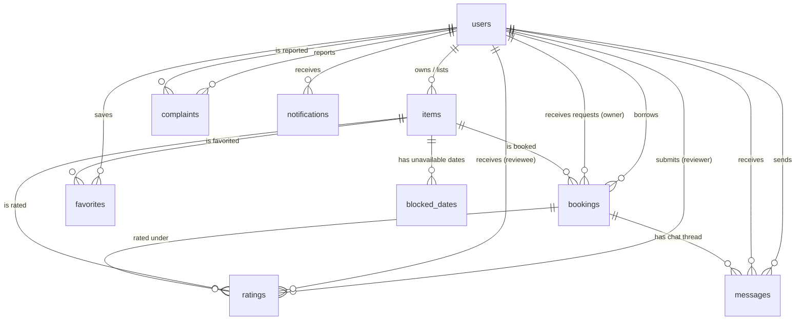

# CS Department Resource Sharing System
## Complete Database Schema Documentation

**Database Engine:** PostgreSQL  
**Database Name:** `resource_sharing_db`  
**Generated On:** October 2026  

---

## 1. Executive Summary

The database architecture is designed for a campus peer-to-peer resource rental and borrowing platform. It tracks user profiles (students and department administrators), listed resources, availability schedules, booking workflows, reviews/ratings, dispute complaints, real-time messages, notifications, and verification tokens.

### Table Inventory (10 Tables)

| # | Table Name | Purpose / Description |
|---|---|---|
| 1 | **`users`** | Student and administrator user accounts, verification, credentials, and reputation scores. |
| 2 | **`items`** | Resource listings posted by students for borrowing/rental (with pricing, deposit, condition, photos). |
| 3 | **`bookings`** | Rental requests between borrowers and owners with status lifecycle (`Pending`, `Accepted`, `Completed`, `Rejected`). |
| 4 | **`ratings`** | Peer ratings (1–5 stars) and reviews for completed bookings with reviewer reputation metrics. |
| 5 | **`complaints`** | User reports against policy violations, damages, or fake listings with admin resolution notes. |
| 6 | **`messages`** | Chat messages (booking-specific communication between borrower & lender, and direct admin threads). |
| 7 | **`notifications`** | In-app user notifications for bookings, chat, ratings, and account status changes. |
| 8 | **`favorites`** | User wishlists/saved items (many-to-many relationship). |
| 9 | **`blocked_dates`** | Owner-managed unavailable date intervals for listed items (holidays, personal use). |
| 10 | **`email_otps`** | Time-limited One-Time Passwords for student email verification and password resets. |

---

## 2. Entity-Relationship Diagram (ERD)

---

## 3. Comprehensive Table Specifications

### 3.1. `users`
Stores user profile information, authentication hashes, and user reputation statistics.

* **Primary Key:** `id`
* **Unique Constraints:** `email`, `enrollment_number`

| Column Name | Data Type | Nullable | Default | Description |
|---|---|---|---|---|
| `id` | `VARCHAR(50)` | **NO** | *None* | Primary Key (e.g. `usr_std_...`, `usr_admin_...`) |
| `name` | `VARCHAR(150)` | **NO** | *None* | Full student or admin name |
| `email` | `VARCHAR(150)` | **NO** | *None* | Unique institutional email address (e.g. `0801cs23...`) |
| `password_hash` | `VARCHAR(255)` | **NO** | *None* | Bcrypt-hashed password |
| `enrollment_number` | `VARCHAR(50)` | **NO** | *None* | Unique college enrollment ID |
| `mobile_number` | `VARCHAR(20)` | YES | `NULL` | Student contact number |
| `department` | `VARCHAR(150)` | YES | `NULL` | Academic department name |
| `semester` | `VARCHAR(50)` | YES | `NULL` | Academic semester (e.g., `4th Semester`) |
| `role` | `VARCHAR(20)` | **NO** | `'student'` | Access role (`'student'` or `'admin'`) |
| `verified` | `BOOLEAN` | YES | `true` | Institutional verification status |
| `is_blocked` | `BOOLEAN` | YES | `false` | True if blocked by admin or auto-blocked (5+ complaints) |
| `avatar` | `TEXT` | YES | `NULL` | Uploaded profile photo relative path (`/uploads/avatars/...`) |
| `complaint_count` | `INTEGER` | YES | `0` | Number of verified complaints filed against user |
| `average_rating` | `NUMERIC` | YES | `5.0` | Average star rating received from peers |
| `total_ratings` | `INTEGER` | YES | `0` | Total number of reviews received |
| `created_at` | `TIMESTAMPTZ` | YES | `now()` | Registration timestamp |
| `updated_at` | `TIMESTAMPTZ` | YES | `now()` | Last profile update timestamp |

---

### 3.2. `items`
Stores resource listings created by students for sharing/renting out.

* **Primary Key:** `id`
* **Foreign Keys:** `owner_id` &rarr; `users(id)` ON DELETE CASCADE
* **Indexes:** `idx_items_owner` on `(owner_id)`

| Column Name | Data Type | Nullable | Default | Description |
|---|---|---|---|---|
| `id` | `VARCHAR(50)` | **NO** | *None* | Primary Key (e.g. `itm_...`) |
| `owner_id` | `VARCHAR(50)` | YES | `NULL` | Foreign Key referencing `users(id)` |
| `title` | `VARCHAR(200)` | **NO** | *None* | Resource name / title |
| `category` | `VARCHAR(100)` | YES | `NULL` | Resource category (e.g. `Calculators`, `Lab Gear`) |
| `description` | `TEXT` | YES | `NULL` | Detailed description of specifications/rules |
| `images` | `TEXT[]` (ARRAY) | YES | `NULL` | Array of image URLs / upload paths |
| `rent_price_per_day` | `NUMERIC` | **NO** | *None* | Rental rate per day in ₹ |
| `security_deposit` | `NUMERIC` | YES | `0` | Refundable security deposit in ₹ |
| `availability` | `BOOLEAN` | YES | `true` | Listing active status (can be paused by owner) |
| `condition` | `VARCHAR(50)` | YES | `NULL` | Physical condition (`Brand New`, `Good`, etc.) |
| `pickup_location` | `VARCHAR(200)` | YES | `NULL` | On-campus pickup point |
| `created_at` | `TIMESTAMPTZ` | YES | `now()` | Listing creation timestamp |
| `updated_at` | `TIMESTAMPTZ` | YES | `now()` | Listing modification timestamp |

---

### 3.3. `bookings`
Stores rental requests and agreements between borrowers and item owners.

* **Primary Key:** `id`
* **Foreign Keys:**
  * `item_id` &rarr; `items(id)` ON DELETE CASCADE
  * `borrower_id` &rarr; `users(id)` ON DELETE CASCADE
  * `owner_id` &rarr; `users(id)` ON DELETE CASCADE
* **Indexes:** `idx_bookings_item` on `(item_id)`, `idx_bookings_borrower` on `(borrower_id)`

| Column Name | Data Type | Nullable | Default | Description |
|---|---|---|---|---|
| `id` | `VARCHAR(50)` | **NO** | *None* | Primary Key (e.g. `bkg_...`) |
| `item_id` | `VARCHAR(50)` | YES | `NULL` | Foreign Key referencing `items(id)` |
| `borrower_id` | `VARCHAR(50)` | YES | `NULL` | Foreign Key referencing `users(id)` (requester) |
| `owner_id` | `VARCHAR(50)` | YES | `NULL` | Foreign Key referencing `users(id)` (lender) |
| `start_date` | `DATE` | **NO** | *None* | Beginning date of rental period |
| `end_date` | `DATE` | **NO** | *None* | End date of rental period |
| `total_days` | `INTEGER` | YES | `NULL` | Rental duration in days |
| `total_cost` | `NUMERIC` | YES | `NULL` | Total cost: `(days * rent_price) + deposit` |
| `status` | `VARCHAR(30)` | YES | `'Pending'` | Booking status (`Pending`, `Accepted`, `Completed`, `Rejected`) |
| `created_at` | `TIMESTAMPTZ` | YES | `now()` | Booking request timestamp |
| `updated_at` | `TIMESTAMPTZ` | YES | `now()` | Status update timestamp |

---

### 3.4. `ratings`
Stores reviews and ratings exchanged after completed bookings.

* **Primary Key:** `id`
* **Check Constraints:** `CHECK (stars >= 1 AND stars <= 5)`
* **Foreign Keys:**
  * `booking_id` &rarr; `bookings(id)` ON DELETE CASCADE
  * `item_id` &rarr; `items(id)` ON DELETE CASCADE
  * `reviewer_id` &rarr; `users(id)` ON DELETE CASCADE
  * `reviewee_id` &rarr; `users(id)` ON DELETE CASCADE
* **Unique Index:** `idx_ratings_booking_reviewer` on `(booking_id, reviewer_id)` *(Enforces 1 rating per participant per booking)*

| Column Name | Data Type | Nullable | Default | Description |
|---|---|---|---|---|
| `id` | `VARCHAR(50)` | **NO** | *None* | Primary Key (e.g. `rtg_...`) |
| `booking_id` | `VARCHAR(50)` | YES | `NULL` | Foreign Key referencing `bookings(id)` |
| `item_id` | `VARCHAR(50)` | YES | `NULL` | Foreign Key referencing `items(id)` |
| `reviewer_id` | `VARCHAR(50)` | YES | `NULL` | Foreign Key referencing `users(id)` (who submitted rating) |
| `reviewee_id` | `VARCHAR(50)` | YES | `NULL` | Foreign Key referencing `users(id)` (who received rating) |
| `stars` | `INTEGER` | YES | `NULL` | Star rating (1 to 5) |
| `comment` | `TEXT` | YES | `NULL` | Written review feedback |
| `created_at` | `TIMESTAMPTZ` | YES | `now()` | Rating submission timestamp |

---

### 3.5. `complaints`
Stores dispute reports against users with proof images and admin resolution tracking.

* **Primary Key:** `id`
* **Foreign Keys:**
  * `reporter_id` &rarr; `users(id)` ON DELETE CASCADE
  * `reported_user_id` &rarr; `users(id)` ON DELETE CASCADE

| Column Name | Data Type | Nullable | Default | Description |
|---|---|---|---|---|
| `id` | `VARCHAR(50)` | **NO** | *None* | Primary Key (e.g. `cmp_...`) |
| `reporter_id` | `VARCHAR(50)` | YES | `NULL` | Foreign Key referencing `users(id)` (reporter) |
| `reported_user_id` | `VARCHAR(50)` | YES | `NULL` | Foreign Key referencing `users(id)` (accused user) |
| `booking_id` | `VARCHAR(50)` | YES | `NULL` | Related booking ID (if dispute is rental-based) |
| `item_title` | `VARCHAR(200)` | YES | `NULL` | Name of the related item |
| `type` | `VARCHAR(100)` | YES | `NULL` | Reason (e.g., `Late Return`, `Item Damaged`, `Fake Listing`) |
| `description` | `TEXT` | YES | `NULL` | Detailed description of the incident |
| `proof_url` | `TEXT` | YES | `NULL` | Uploaded proof image path (`/uploads/complaint-proofs/...`) |
| `status` | `VARCHAR(30)` | YES | `'Pending'` | Status (`Pending`, `Under Review`, `Resolved`, `Dismissed`) |
| `admin_note` | `TEXT` | YES | `NULL` | Resolution notes added by Administrator |
| `created_at` | `TIMESTAMPTZ` | YES | `now()` | Complaint submission timestamp |

---

### 3.6. `messages`
Stores chat messages between users (both booking-specific chats and direct student-to-admin support threads).

* **Primary Key:** `id`
* **Foreign Keys:**
  * `booking_id` &rarr; `bookings(id)` ON DELETE CASCADE (`NULL` for direct student-admin chat)
  * `sender_id` &rarr; `users(id)` ON DELETE CASCADE
  * `receiver_id` &rarr; `users(id)` ON DELETE CASCADE
* **Indexes:** `idx_messages_booking` on `(booking_id)`

| Column Name | Data Type | Nullable | Default | Description |
|---|---|---|---|---|
| `id` | `VARCHAR(50)` | **NO** | *None* | Primary Key (e.g. `msg_...`) |
| `booking_id` | `VARCHAR(50)` | YES | `NULL` | Foreign Key referencing `bookings(id)` |
| `sender_id` | `VARCHAR(50)` | YES | `NULL` | Foreign Key referencing `users(id)` |
| `receiver_id` | `VARCHAR(50)` | YES | `NULL` | Foreign Key referencing `users(id)` |
| `content` | `TEXT` | **NO** | *None* | Message text body |
| `is_read` | `BOOLEAN` | YES | `false` | Read receipt flag |
| `timestamp` | `TIMESTAMPTZ` | YES | `now()` | Sent timestamp |

---

### 3.7. `notifications`
Stores in-app alerts and notifications delivered to users.

* **Primary Key:** `id`
* **Foreign Keys:** `user_id` &rarr; `users(id)` ON DELETE CASCADE
* **Indexes:** `idx_notifications_user` on `(user_id)`

| Column Name | Data Type | Nullable | Default | Description |
|---|---|---|---|---|
| `id` | `VARCHAR(50)` | **NO** | *None* | Primary Key (e.g. `ntf_...`) |
| `user_id` | `VARCHAR(50)` | YES | `NULL` | Foreign Key referencing `users(id)` |
| `title` | `VARCHAR(200)` | YES | `NULL` | Notification title header |
| `message` | `TEXT` | YES | `NULL` | Notification body text |
| `type` | `VARCHAR(50)` | YES | `NULL` | Category (`booking`, `chat`, `rating`, `complaint`, `system`) |
| `link` | `TEXT` | YES | `NULL` | In-app redirect URL / path |
| `read` | `BOOLEAN` | YES | `false` | Read status |
| `created_at` | `TIMESTAMPTZ` | YES | `now()` | Creation timestamp |

---

### 3.8. `favorites`
Join table tracking items bookmarked / favorited by students.

* **Primary Key:** Composite `(user_id, item_id)`
* **Foreign Keys:**
  * `user_id` &rarr; `users(id)` ON DELETE CASCADE
  * `item_id` &rarr; `items(id)` ON DELETE CASCADE

| Column Name | Data Type | Nullable | Default | Description |
|---|---|---|---|---|
| `user_id` | `VARCHAR(50)` | **NO** | *None* | Composite PK & FK referencing `users(id)` |
| `item_id` | `VARCHAR(50)` | **NO** | *None* | Composite PK & FK referencing `items(id)` |
| `created_at` | `TIMESTAMPTZ` | YES | `now()` | Timestamp when item was favorited |

---

### 3.9. `blocked_dates`
Owner-managed dates where an item cannot be booked (vacations, personal use, maintenance).

* **Primary Key:** `id`
* **Foreign Keys:** `item_id` &rarr; `items(id)` ON DELETE CASCADE
* **Indexes:** `idx_blocked_dates_item` on `(item_id)`

| Column Name | Data Type | Nullable | Default | Description |
|---|---|---|---|---|
| `id` | `VARCHAR(50)` | **NO** | *None* | Primary Key (e.g. `blk_...`) |
| `item_id` | `VARCHAR(50)` | YES | `NULL` | Foreign Key referencing `items(id)` |
| `start_date` | `DATE` | **NO** | *None* | Start of unavailable date range |
| `end_date` | `DATE` | **NO** | *None* | End of unavailable date range |
| `reason` | `TEXT` | YES | `NULL` | Reason (e.g., `Owner unavailable`, `Maintenance`) |
| `created_at` | `TIMESTAMPTZ` | YES | `now()` | Entry creation timestamp |

---

### 3.10. `email_otps`
Stores temporary verification codes for registration and password resets.

* **Primary Key:** `id`
* **Indexes:** `idx_email_otps_email` on `(email)`

| Column Name | Data Type | Nullable | Default | Description |
|---|---|---|---|---|
| `id` | `VARCHAR(50)` | **NO** | *None* | Primary Key |
| `email` | `VARCHAR(100)` | **NO** | *None* | Student institutional email |
| `otp_code` | `VARCHAR(10)` | **NO** | *None* | Generated OTP code |
| `verified` | `BOOLEAN` | **NO** | `false` | True once successfully verified |
| `expires_at` | `TIMESTAMP` | **NO** | *None* | Expiry cutoff timestamp |
| `created_at` | `TIMESTAMP` | **NO** | `now()` | Generation timestamp |

---

## 4. Key Security & Integrity Features

1. **Cascade Deletes:** Foreign keys use `ON DELETE CASCADE`. If a user or item is removed by an admin, all orphaned bookings, reviews, messages, and notifications are cleanly purged automatically.
2. **Double-Rating Prevention:** The unique index `idx_ratings_booking_reviewer` prevents duplicate ratings at the database level.
3. **Rating Range Validation:** Check constraint `ratings_stars_check` ensures only star ratings between 1 and 5 can be inserted.
4. **Institutional Email Integrity:** Unique constraint on `users.email` and `users.enrollment_number` guarantees single-account enrollment.
